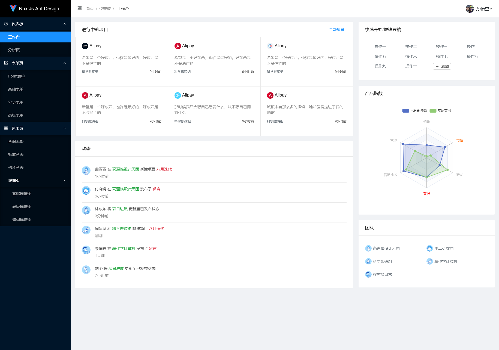
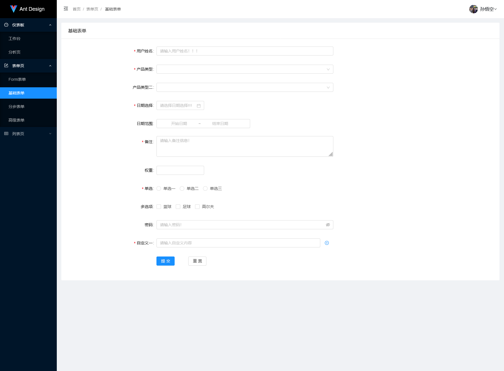
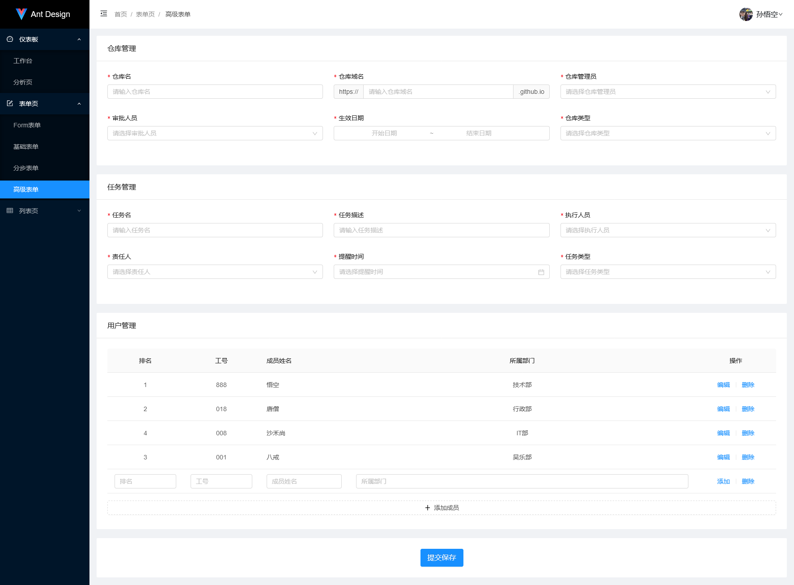
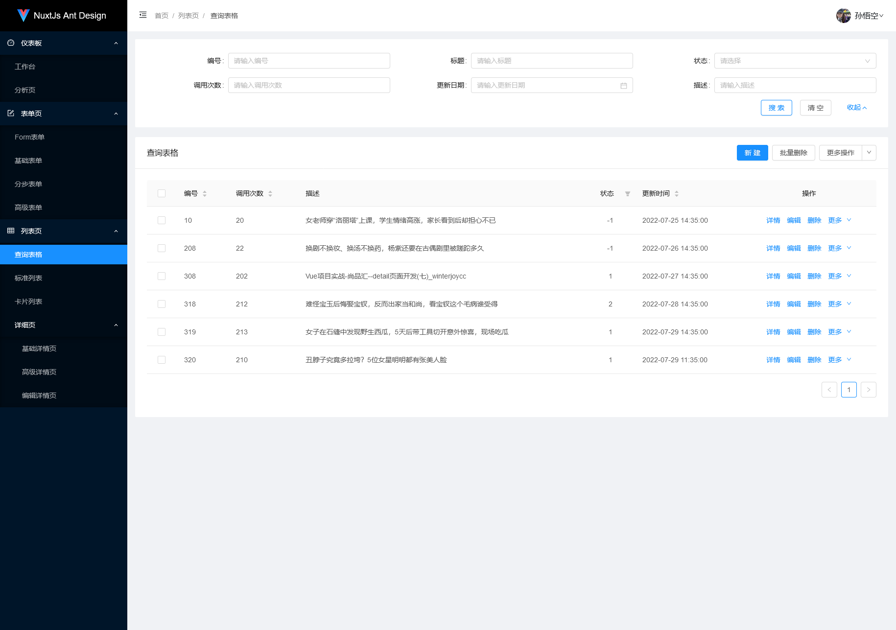

<h1 align="center">NuxtJs Antd Admin</h1>

<div align="center">
  
[Ant Design Pro](https://github.com/ant-design/ant-design-pro) 的 NuxtJs 实现版本  
开箱即用的中后台前端/设计解决方案
  
  




</div>

- 预览地址：https://github.com/sunxl5188/nuxtjs-antd-admin.git
- 使用文档：开发中
- 常见问题：开发中
- 国内镜像：https://github.com/sunxl5188/nuxtjs-antd-admin.git

## 浏览器支持
现代浏览器及 IE10

| [](http://godban.github.io/browsers-support-badges/)</br>IE / Edge | [](http://godban.github.io/browsers-support-badges/)</br>Firefox | [](http://godban.github.io/browsers-support-badges/)</br>Chrome | [](http://godban.github.io/browsers-support-badges/)</br>Safari | [](http://godban.github.io/browsers-support-badges/)</br>Opera |
| --- | --- | --- | --- | --- |
| IE10, Edge | last 2 versions | last 2 versions | last 2 versions | last 2 versions |

## 使用
### clone
```bash
$ git clone https://github.com/sunxl5188/nuxtjs-antd-admin.git
```
### yarn
```bash
$ yarn install
$ yarn serve
```
### or npm
```
$ npm install
$ npm run dev
```
